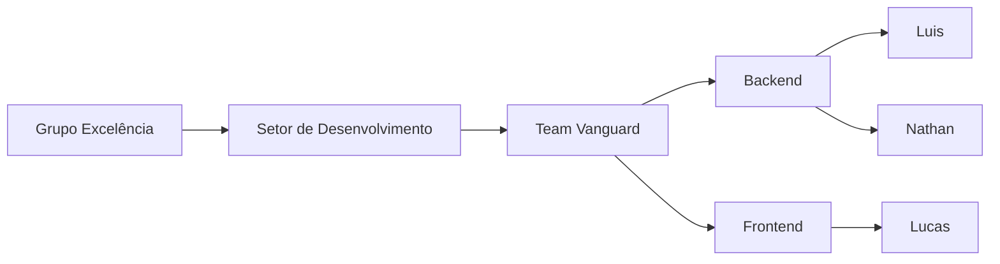
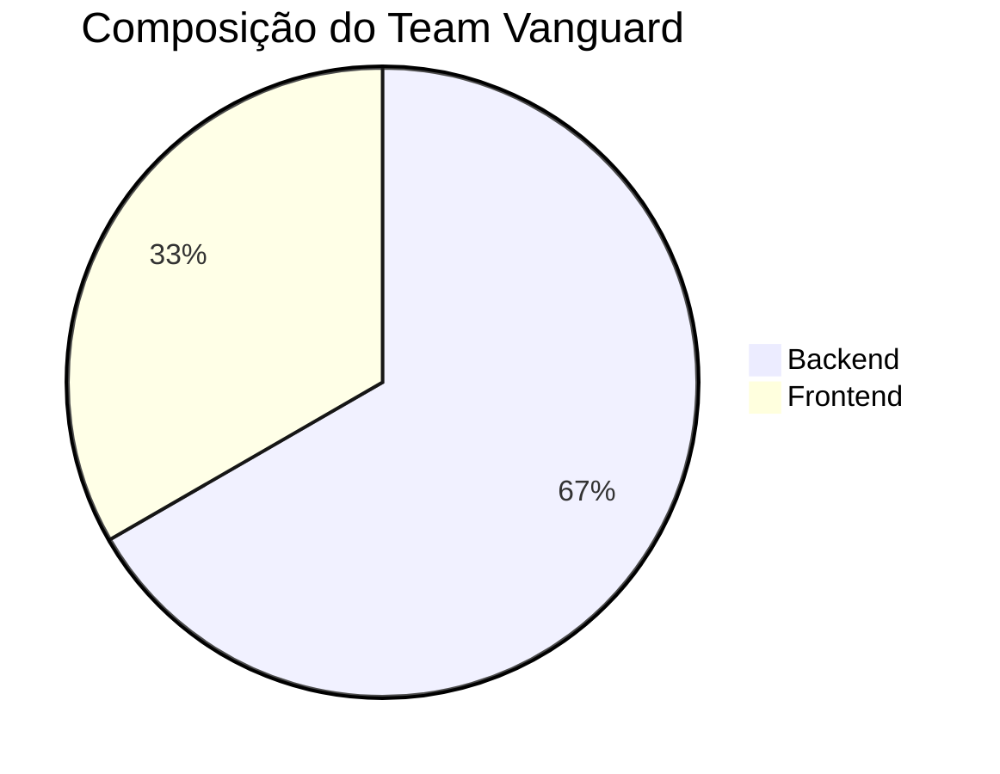
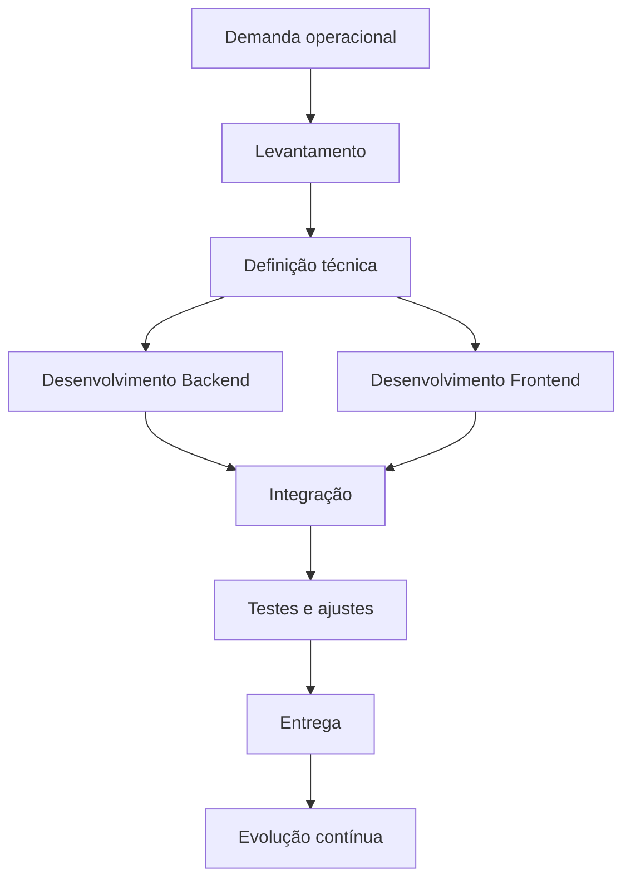

  
  &nbsp;&nbsp;&nbsp;&nbsp;
  

---

## Sobre o time

O **Team Vanguard** é o time de **Desenvolvimento** do **Grupo Excelência**, responsável por projetar, construir e evoluir soluções digitais com foco em:

- organização
- confiabilidade
- performance
- experiência de uso
- apoio direto à operação

Nosso objetivo é transformar necessidades internas em sistemas claros, funcionais, escaláveis e sustentáveis.

---

## Integrantes

### Backend
- **Luis**
- **Nathan**

### Frontend
- **Lucas**

---

## Estrutura do time

---

## Distribuição do time

---

## Áreas de atuação

O time trabalha em iniciativas voltadas para:

- desenvolvimento de sistemas internos
- automação de processos
- integração entre fluxos operacionais
- estruturação de APIs e regras de negócio
- construção de interfaces modernas e intuitivas
- manutenção e evolução contínua de plataformas

---

## Fluxo de entrega

---

## Responsabilidades técnicas

### Backend

Responsável por:

- regras de negócio
- modelagem de dados
- APIs
- integrações
- segurança
- estabilidade e performance

### Frontend

Responsável por:

- interface do usuário
- experiência de navegação
- organização visual
- responsividade
- interação com o sistema

---

## Visão do time

Desenvolver soluções que não sejam apenas funcionais, mas que realmente ajudem as pessoas a trabalhar melhor, com mais clareza, agilidade e confiança.

Buscamos construir sistemas com:

- legibilidade
- consistência
- boa experiência de uso
- evolução contínua
- foco prático no negócio

---

## Princípios do Team Vanguard

- **Clareza** para construir sistemas fáceis de entender e operar
- **Confiabilidade** para sustentar a operação com segurança
- **Colaboração** como base do desenvolvimento em equipe
- **Evolução constante** para melhorar processos e produtos
- **Foco no resultado** para entregar tecnologia útil ao negócio

---

## Frentes técnicas

Dependendo do projeto, o Team Vanguard atua com:

- backend
- frontend
- automações
- integração com bancos de dados
- APIs REST
- painéis administrativos
- sistemas internos corporativos

---

## Missão

Fortalecer o **Grupo Excelência** com soluções tecnológicas bem construídas, funcionais e sustentáveis, apoiando o crescimento da operação por meio do desenvolvimento de software.

---

## Identidade

| Item | Valor |
|---|---|
| Grupo | **Excelência** |
| Setor | **Desenvolvimento** |
| Time | **Vanguard** |

---

## Propósito deste espaço

Este espaço representa o time de desenvolvimento do Grupo Excelência e pode ser utilizado para centralizar:

- projetos
- documentações
- padrões
- instruções técnicas
- evolução das soluções mantidas pelo time

---

**Team Vanguard**  
Desenvolvimento com estrutura, clareza e evolução contínua.

